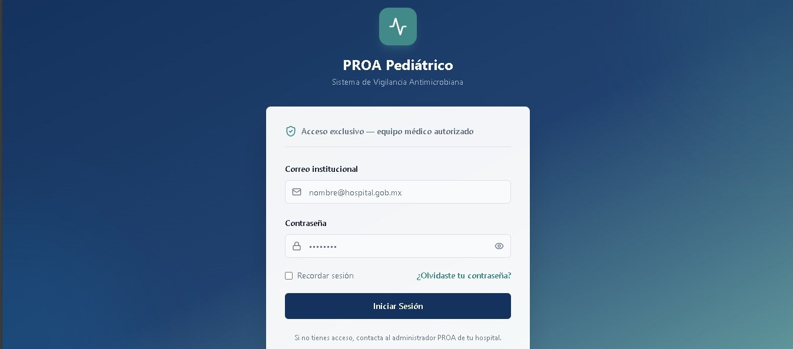
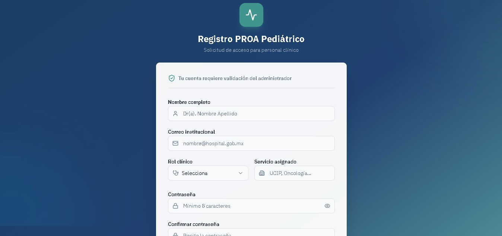
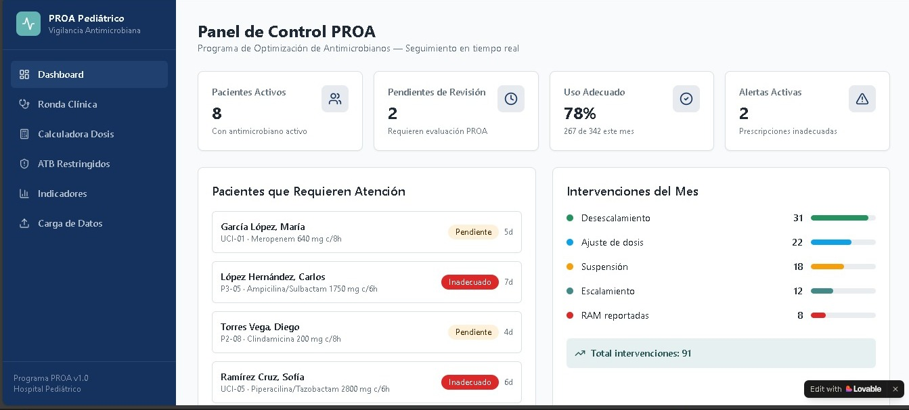
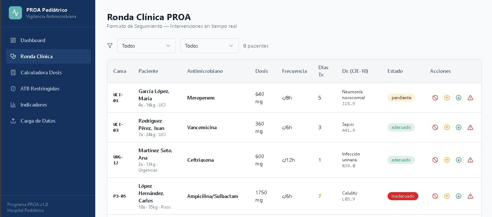
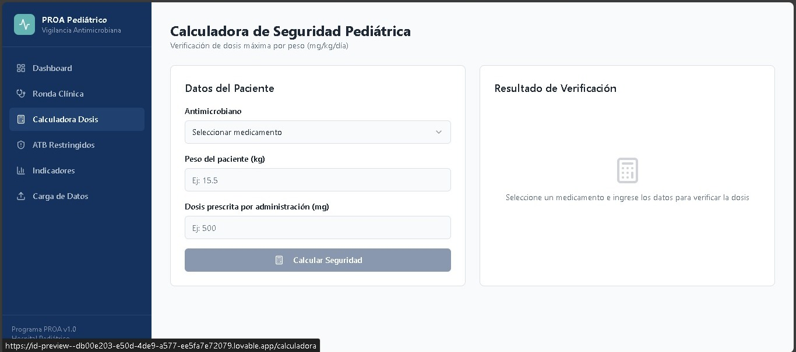
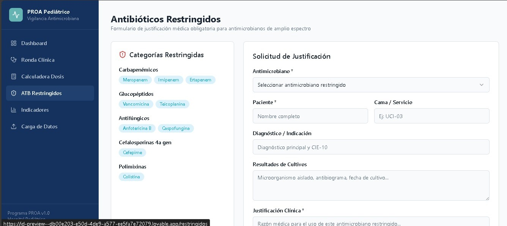
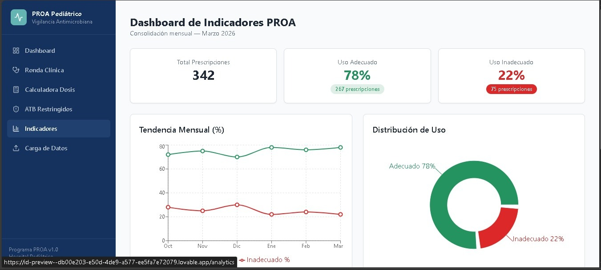
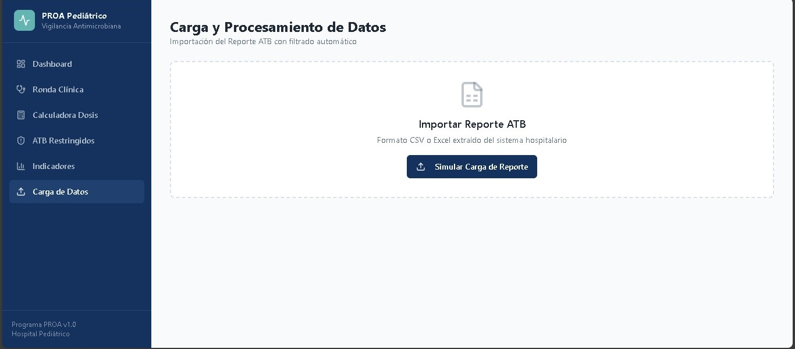

```md
# 🏥 PROA Pediátrico Frontend

Sistema web para el **Programa de Optimización de Antimicrobianos (PROA)** enfocado en población pediátrica.  
Permite el control, visualización y gestión de datos clínicos relacionados con el uso de antibióticos.

---

# 🚀 Tecnologías Utilizadas

- ⚛️ React (Vite)
- 🧭 react-router-dom (navegación)
- 🎨 TailwindCSS (estilos)
- 🎬 framer-motion (animaciones)
- 🔔 sonner (notificaciones)
- 📊 recharts (gráficas)
- 🎯 lucide-react (iconos)

---

# 📁 Estructura del Proyecto


src/
│
├── components/
│   ├── AppLayout.jsx
│   ├── ProtectedRoutes.jsx
│   ├── StatCard.jsx
│
├── context/
│   ├── AuthContext.jsx
│   ├── AuthProvider.jsx
│
├── hooks/
│   ├── useAuth.js
│
├── pages/
│   ├── Index.jsx (Login)
│   ├── Register.jsx
│   ├── Dashboard.jsx
│   ├── ClinicalRound.jsx
│   ├── Indicators.jsx
│   ├── DataUpload.jsx
│   ├── RestrictedAntibiotics.jsx
│   ├── PediatricCalculator.jsx
│
├── services/
│   ├── dataService.js (mocks de datos)
│
└── App.jsx

```

# 🧭 Mapa de Rutas

| Ruta | Descripción | Protección |
|------|------------|------------|
| `/login` | Inicio de sesión | ❌ Pública |
| `/register` | Registro de usuario | ❌ Pública |
| `/` | Dashboard principal | ✅ Protegida |
| `/ronda` | Ronda clínica | ✅ Protegida |
| `/indicadores` | Indicadores | ✅ Protegida |
| `/carga` | Carga de datos | ✅ Protegida |
| `/restringidos` | Antibióticos restringidos | ✅ Protegida |
| `/calculadora` | Calculadora pediátrica | ✅ Protegida |

```
---

# 🔐 Autenticación y Protección de Rutas

La aplicación utiliza **Context API** para manejar la sesión:

### 📌 AuthContext
- Almacena el usuario autenticado
- Permite login y logout

### 📌 Persistencia
- Se usa `localStorage`:
  ```js
  localStorage.setItem("proa_user", JSON.stringify(user))
````

### 📌 Protección de rutas

```jsx
const ProtectedRoute = ({ children }) => {
  const { user } = useAuth();
  if (!user) return <Navigate to="/login" replace />;
  return children;
};
```

✔ Si el usuario no está autenticado → redirige a `/login`

---

# 🔑 Flujo de Autenticación

### Login

* Validación de campos
* Simulación de usuario
* Guarda sesión en localStorage
* Redirección a `/dashboard`

### Registro

* Formulario controlado con `useState`
* Validación:

  * Contraseñas coinciden
  * Longitud mínima
  * Aceptación de términos
* Simulación de envío

### Logout

* Limpia estado
* Elimina localStorage
* Redirige a `/login`

---

# 📊 Gestión de Datos (Mocks)

Los datos no están “quemados” en componentes.

✔ Se almacenan en:

```
src/services/dataService.js
```

Ejemplo:

```js
export const statsData = [ ... ];
export const usageData = [ ... ];
```

✔ Se consumen mediante props en componentes como:

```jsx
<StatCard {...data} />
```

---

# 📥 Carga de Datos

En `DataUpload.jsx`:

* Simulación de carga de archivos (CSV/Excel)
* Procesamiento visual
* Feedback con `toast`
* Resumen de resultados:

  * registros importados
  * duplicados eliminados
  * datos filtrados

---

# 🎯 Componentes Clave

### 📦 StatCard

* Reutilizable
* Recibe props
* Muestra métricas clínicas

### 📦 AppLayout

* Sidebar + Header
* Muestra usuario logueado
* Permite logout

---

# 🔄 Preparación para API

El proyecto está preparado para escalar a backend:

✔ Uso de estado centralizado (`AuthContext`)
✔ Separación de datos (`services/`)
✔ Componentes desacoplados con props

👉 En el futuro:

* Reemplazar mocks por `fetch` o `axios`
* Usar `useEffect` para consumir API

---

# 🧪 Buenas Prácticas Implementadas

* ✔ Componentes reutilizables
* ✔ Separación de responsabilidades
* ✔ Manejo de estado con hooks
* ✔ Navegación protegida
* ✔ Validación de formularios
* ✔ Feedback al usuario

---

# 🛠️ Instalación

```bash
npm install
npm run build
npm run dev
```

---

# 📌 Notas

* Proyecto académico enfocado en frontend
* Simulación de backend con datos locales
* Escalable a arquitectura con API REST

---

# 👨‍⚕️ Autores

Proyecto desarrollado para el sistema PROA Pediátrico.

## 👨‍💻 Equipo de Desarrollo

| 👤 | Nombre | Rol | Descripción |
|----|--------|-----|------------|
|  | **Judy Cuartas** | Frontend | React, Auth, rutas protegidas, dashboard y carga de datos clínicos. |

| 👤 | Nombre | Rol | Descripción |
|----|--------|-----|------------|
|  | **Stibel Baena** | Frontend | React, Auth, rutas protegidas, dashboard y carga de datos clínicos. |

---

## 📸 Mockups de la Aplicación

### 🔐 Login


### 📝 Registro


### 📊 Dashboard


### 📥 Ronda clínica


### 📥 Calculadora dosis


### 📥 Antibióticos restringidos


### 📥 Indicadores


### 📥 Carga de datos
